# OneVoice Backend V1

AI 기반 음성 더빙 서비스 백엔드 API

## Architecture

```mermaid
graph TB
%% === STYLES ===
classDef core fill:#1E90FF,stroke:#000,color:#000,stroke-width:2px,rx:10px,ry:10px;
classDef db fill:#9ACD32,stroke:#000,color:#000,stroke-width:2px,rx:10px,ry:10px;
classDef external fill:#FFD700,stroke:#000,color:#000,stroke-width:2px,rx:10px,ry:10px;
classDef worker fill:#DA70D6,stroke:#000,color:#000,stroke-width:2px,rx:10px,ry:10px;

%% === USERS ===
User(("User<br/>Interacts via API"))

%% === API LAYER ===
subgraph "API Layer"
  FastAPI["FastAPI Application<br/>Main Application"]:::core
  AuthRouter["Auth Router<br/>Handles Registration, Login"]:::core
  UsersRouter["Users Router<br/>Manages Profiles, Activity"]:::core
  VideosRouter["Videos Router<br/>Handles Uploads, Metadata"]:::core
  BillingRouter["Billing Router<br/>Manages Payments, Subscriptions"]:::core
  JobsRouter["Jobs Router<br/>Controls Background Jobs"]:::core
end

User -->|"API Calls"| FastAPI
FastAPI -->|"routes requests"| AuthRouter
FastAPI -->|"routes requests"| UsersRouter
FastAPI -->|"routes requests"| VideosRouter
FastAPI -->|"routes requests"| BillingRouter
FastAPI -->|"routes requests"| JobsRouter

%% === SERVICES LAYER ===
subgraph "Core Business Logic"
  AuthService["Auth Service<br/>Authentication, Token Management"]:::core
  UserService["User Service<br/>Profile, Billing Management"]:::core
  VideoService["Video Service<br/>CRUD, Media Handling"]:::core
  BillingService["Billing Service<br/>Payment Processing"]:::core
  JobService["Job Service<br/>Job Lifecycle Management"]:::core
  DubbingService["Dubbing Service<br/>AI Dubbing Pipeline"]:::core
  NotificationService["Notification Service<br/>Email Notifications"]:::core
  StorageService["Storage Service<br/>S3 Interactions"]:::core
end

AuthRouter -->|"auth requests"| AuthService
UsersRouter -->|"user operations"| UserService
VideosRouter -->|"video operations"| VideoService
BillingRouter -->|"billing operations"| BillingService
JobsRouter -->|"job operations"| JobService

%% === DATA LAYER ===
subgraph "Data Layer"
  UserModel["User Model<br/>User Info, Subscription"]:::db
  VideoModel["Video Model<br/>Metadata, Media Files"]:::db
  BillingModel["Billing Model<br/>Records, Credit Usage"]:::db
  JobModel["Job Model<br/>Job Status, Progress"]:::db
  PendingUserModel["Pending User Model<br/>Awaiting Verification"]:::db
end

UserService -->|"manage user data"| UserModel
VideoService -->|"manage video data"| VideoModel
BillingService -->|"manage billing data"| BillingModel
JobService -->|"manage job data"| JobModel

%% === EXTERNAL INTEGRATIONS ===
subgraph "AI Modules"
  SpeechRecognition["Speech Recognition<br/>OpenAI, ElevenLabs, WhisperX"]:::external
  Translation["Translation<br/>GPT-based Prompts"]:::external
  TTS["Text-to-Speech<br/>OpenAI, FishTTS"]:::external
  AudioProcessing["Audio Processing<br/>Pydub, librosa"]:::external
end

DubbingService -->|"uses modules"| SpeechRecognition
DubbingService -->|"uses modules"| Translation
DubbingService -->|"uses modules"| TTS
DubbingService -->|"uses modules"| AudioProcessing

subgraph "Billing & Payments"
  Paddle["Paddle<br/>Payment Provider"]:::external
end

BillingService -->|"process payments"| Paddle

subgraph "Message Queue"
  SQSClient["SQS Client<br/>Handles Message Sending"]:::core
  Consumer["Consumer<br/>Processes Messages"]:::core
  Dispatcher["Dispatcher<br/>Enqueues Jobs"]:::core
end

JobService -->|"enqueue jobs"| Dispatcher
Dispatcher -->|"send messages"| SQSClient
SQSClient -->|"process messages"| Consumer

%% === BACKGROUND WORKERS ===
subgraph "Background Workers"
  Runner["Runner<br/>Polls SQS, Triggers Dubbing"]:::worker
  Handlers["Handlers<br/>Executes Dubbing Tasks"]:::worker
end

Consumer -->|"triggers tasks"| Runner
Runner -->|"executes tasks"| Handlers

%% === MONITORING & LOGGING ===
subgraph "Monitoring & Logging"
  HealthCheck["Health Check<br/>System Resource Checks"]:::core
  Logging["Logging<br/>Structured Logging"]:::core
end

FastAPI -->|"health endpoints"| HealthCheck
FastAPI -->|"logging setup"| Logging

%% === USER INTERACTION ===
User -->|"register/login"| AuthRouter
User -->|"manage videos"| VideosRouter
User -->|"manage billing"| BillingRouter
User -->|"control jobs"| JobsRouter

%% === JOB LIFECYCLE ===
User -->|"initiate dubbing"| VideosRouter
VideosRouter -->|"calls"| DubbingService
DubbingService -->|"enqueue job"| Dispatcher
Consumer -->|"processes job"| DubbingService

DubbingService -->|"updates status"| JobModel
DubbingService -->|"sends notifications"| NotificationService
```

## 영상 더빙 서비스 아키텍처 상세 구현 방안

- **데이터 흐름**: 사용자 요청 → Route 53 → Web Server(EB) → SQS → Worker(EB) → 결과 처리

### 1) 웹 서버 환경 (Web)
- **역할**: 업로드·더빙 요청·상태 조회·결과 다운로드 등 실시간 API 처리
- **핵심**: 빠른 응답 및 비동기 위임
- **구현**
  - `POST /dubbing-jobs`: 파일 S3 `originals/` 업로드 → RDS `Jobs` 생성(`PENDING`) → SQS에 `job_id` 송신 → 즉시 `job_id` 응답
  - `GET /dubbing-jobs/{job_id}`: RDS `Jobs.status` 조회(PENDING/PROCESSING/COMPLETED/FAILED)

### 2) SQS
- **역할**: Web-Worker 사이 비동기 버퍼
- **구현**: 표준 큐 생성(예: `DubbingJobsQueue`), Web은 SendMessage, Worker는 Receive→처리→DeleteMessage

### 3) 작업자 환경 (Worker)
- **역할**: CPU/GPU 집약적 더빙 파이프라인 실행
- **절차**
  1. SQSD/폴링으로 새 메시지 수신 후 애플리케이션에 POST 전달
  2. `job_id`로 RDS 조회 → 상태 `PROCESSING` 업데이트
  3. S3 `originals/`에서 다운로드 → 더빙 처리(ASR/번역/TTS/FFmpeg 등)
  4. 결과를 S3 `results/` 업로드 → RDS `COMPLETED` 및 결과 경로 저장
  5. 필요 시 SES로 완료 알림, 메시지 Delete로 중복 방지

### 4) 스토리지·데이터베이스·모니터링
- **S3**: 용도별 분리(`originals/`, `results/`), Presigned URL로 안전·저부하 업/다운로드
- **RDS**: `Users`, `Jobs(job_id,status,original_s3_path,result_s3_path,created_at,...)` 기본 스키마, Private Subnet에서 접근 통제
- **모니터링**: CloudWatch Logs/지표/알람, SQS 큐 깊이·CPU 사용률 기반 관측, SNS로 경보 알림
- **도메인**: Route 53으로 사용자 정의 도메인을 EB 환경에 매핑