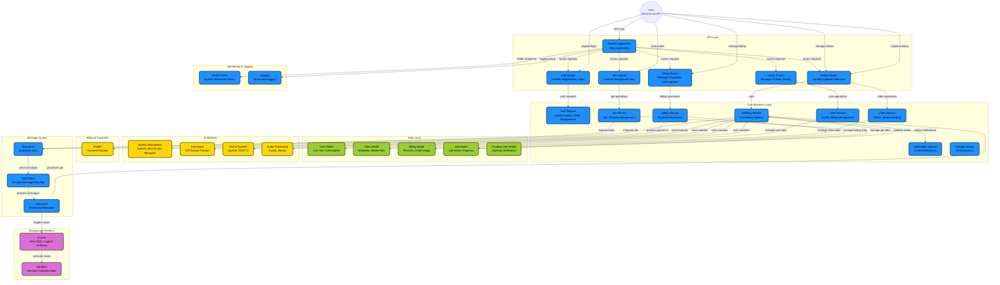

# OneVoice Backend V1

AI 기반 음성 더빙 서비스 백엔드 API

## Architecture

```mermaid
graph TB
%% === STYLES ===
classDef core fill:#1E90FF,stroke:#000,color:#000,stroke-width:2px,rx:10px,ry:10px;
classDef db fill:#9ACD32,stroke:#000,color:#000,stroke-width:2px,rx:10px,ry:10px;
classDef external fill:#FFD700,stroke:#000,color:#000,stroke-width:2px,rx:10px,ry:10px;
classDef worker fill:#DA70D6,stroke:#000,color:#000,stroke-width:2px,rx:10px,ry:10px;

%% === USERS ===
User(("User<br/>Interacts via API"))

%% === API LAYER ===
subgraph "API Layer"
  FastAPI["FastAPI Application<br/>Main Application"]:::core
  AuthRouter["Auth Router<br/>Handles Registration, Login"]:::core
  UsersRouter["Users Router<br/>Manages Profiles, Activity"]:::core
  VideosRouter["Videos Router<br/>Handles Uploads, Metadata"]:::core
  BillingRouter["Billing Router<br/>Manages Payments, Subscriptions"]:::core
  JobsRouter["Jobs Router<br/>Controls Background Jobs"]:::core
end

User -->|"API Calls"| FastAPI
FastAPI -->|"routes requests"| AuthRouter
FastAPI -->|"routes requests"| UsersRouter
FastAPI -->|"routes requests"| VideosRouter
FastAPI -->|"routes requests"| BillingRouter
FastAPI -->|"routes requests"| JobsRouter

%% === SERVICES LAYER ===
subgraph "Core Business Logic"
  AuthService["Auth Service<br/>Authentication, Token Management"]:::core
  UserService["User Service<br/>Profile, Billing Management"]:::core
  VideoService["Video Service<br/>CRUD, Media Handling"]:::core
  BillingService["Billing Service<br/>Payment Processing"]:::core
  JobService["Job Service<br/>Job Lifecycle Management"]:::core
  DubbingService["Dubbing Service<br/>AI Dubbing Pipeline"]:::core
  NotificationService["Notification Service<br/>Email Notifications"]:::core
  StorageService["Storage Service<br/>S3 Interactions"]:::core
end

AuthRouter -->|"auth requests"| AuthService
UsersRouter -->|"user operations"| UserService
VideosRouter -->|"video operations"| VideoService
BillingRouter -->|"billing operations"| BillingService
JobsRouter -->|"job operations"| JobService

%% === DATA LAYER ===
subgraph "Data Layer"
  UserModel["User Model<br/>User Info, Subscription"]:::db
  VideoModel["Video Model<br/>Metadata, Media Files"]:::db
  BillingModel["Billing Model<br/>Records, Credit Usage"]:::db
  JobModel["Job Model<br/>Job Status, Progress"]:::db
  PendingUserModel["Pending User Model<br/>Awaiting Verification"]:::db
end

UserService -->|"manage user data"| UserModel
VideoService -->|"manage video data"| VideoModel
BillingService -->|"manage billing data"| BillingModel
JobService -->|"manage job data"| JobModel

%% === EXTERNAL INTEGRATIONS ===
subgraph "AI Modules"
  SpeechRecognition["Speech Recognition<br/>OpenAI, ElevenLabs, WhisperX"]:::external
  Translation["Translation<br/>GPT-based Prompts"]:::external
  TTS["Text-to-Speech<br/>OpenAI, FishTTS"]:::external
  AudioProcessing["Audio Processing<br/>Pydub, librosa"]:::external
end

DubbingService -->|"uses modules"| SpeechRecognition
DubbingService -->|"uses modules"| Translation
DubbingService -->|"uses modules"| TTS
DubbingService -->|"uses modules"| AudioProcessing

subgraph "Billing & Payments"
  Paddle["Paddle<br/>Payment Provider"]:::external
end

BillingService -->|"process payments"| Paddle

subgraph "Message Queue"
  SQSClient["SQS Client<br/>Handles Message Sending"]:::core
  Consumer["Consumer<br/>Processes Messages"]:::core
  Dispatcher["Dispatcher<br/>Enqueues Jobs"]:::core
end

JobService -->|"enqueue jobs"| Dispatcher
Dispatcher -->|"send messages"| SQSClient
SQSClient -->|"process messages"| Consumer

%% === BACKGROUND WORKERS ===
subgraph "Background Workers"
  Runner["Runner<br/>Polls SQS, Triggers Dubbing"]:::worker
  Handlers["Handlers<br/>Executes Dubbing Tasks"]:::worker
end

Consumer -->|"triggers tasks"| Runner
Runner -->|"executes tasks"| Handlers

%% === MONITORING & LOGGING ===
subgraph "Monitoring & Logging"
  HealthCheck["Health Check<br/>System Resource Checks"]:::core
  Logging["Logging<br/>Structured Logging"]:::core
end

FastAPI -->|"health endpoints"| HealthCheck
FastAPI -->|"logging setup"| Logging

%% === USER INTERACTION ===
User -->|"register/login"| AuthRouter
User -->|"manage videos"| VideosRouter
User -->|"manage billing"| BillingRouter
User -->|"control jobs"| JobsRouter

%% === JOB LIFECYCLE ===
User -->|"initiate dubbing"| VideosRouter
VideosRouter -->|"calls"| DubbingService
DubbingService -->|"enqueue job"| Dispatcher
Consumer -->|"processes job"| DubbingService

DubbingService -->|"updates status"| JobModel
DubbingService -->|"sends notifications"| NotificationService
```